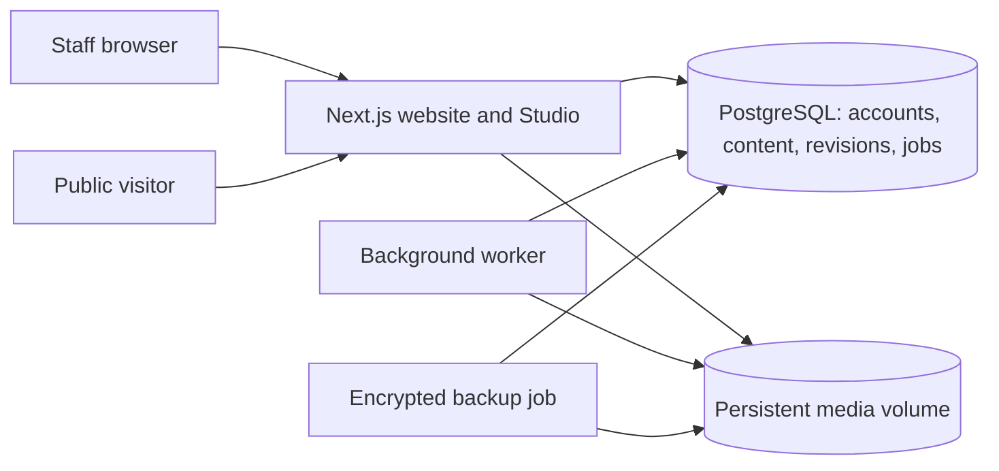

# NammaOffice Studio — local review and VPS operations

This is the active CMS implementation. The earlier shared-password/Upstash/Blob implementation is superseded. Nothing in this work has been committed, pushed, or deployed. Live Vercel content and billing settings have not been changed.

## Review on this Mac

Open **http://127.0.0.1:3001/admin/login**. The generated administrator email and password are in `.local/cms/initial-admin.json` (private, ignored by Git). Sign in with the staff email and password; no CMS authenticator step is required. Change the initial password and remove the credentials file after saving it securely.

The local content library contains the **36 logos from this repository**. It is not an export of the current live Blob store. The initial delivery left editorial sections empty. At your request, the local review database now also contains 55 clearly marked demo entries and seven demo accounts; see [the demo walkthrough](./demo-studio.md). Automated regression tests still use a separate database.

If the server is stopped, run `npm run cms:dev` from this directory. It starts this project's dedicated PostgreSQL 18 cluster on loopback port **55432**, applies idempotent schema setup, and starts Next.js on **3001** plus the media/publishing worker. It does not use or change the default Homebrew PostgreSQL service. PostgreSQL was installed locally for this work. Configuration is in `.env.development.local`; data is under `.local/`. Do not delete these directories if you want to keep local content and accounts. Stop the launcher with Ctrl+C; the database remains available.

Use the 127.0.0.1 URL consistently, since localhost and 127.0.0.1 have separate browser cookies. Password invitations/resets go to a **local outbox**, visible to an authenticated administrator under Team access. No CMS email leaves this machine. Open the invitation in a private browser window to test the invited account without replacing your administrator session.

Suggested review:

1. Add a client logo. Choose original artwork, adjust optional crop/padding, prepare it, inspect the result, save a draft, then publish. Check the homepage. Replace it with a draft and verify the old published logo stays visible until you publish again. Archive it to remove it from the homepage.
2. Create a blog and news article. Add formatted text, a cover with an image description, and a URL slug. Preview, publish, edit without publishing, then restore an earlier revision. Verify the public page retains the published version during draft edits.
3. Create a case study with client, challenge, solution, results, metrics and optional gallery. Add a testimonial and check the homepage.
4. Schedule news a few minutes ahead. Leave the worker running and confirm publication. Editing scheduled content cancels its schedule; schedule again after editing.
5. Invite an author via the local outbox. Verify they can write their own articles and submit for review but cannot publish or manage team accounts. An editor can publish; an administrator controls access.

## Architecture and permissions



| Role | Content | Publication | Team access |
| --- | --- | --- | --- |
| Administrator | All content and media | Publish, schedule, archive, restore | Invite, disable, change roles, revoke sessions |
| Editor | All content and media | Publish, schedule, archive, restore | None |
| Author | Own blogs, news, case studies and media | Draft and submit for review | None |

The UI is custom and scoped to NammaOffice. Better Auth handles password hashing, sessions, reset tokens and Google OAuth; PostgreSQL holds structured records and immutable revisions. Each save checks the expected version inside a database transaction, so a stale browser receives a conflict instead of silently overwriting another editor. Public pages read the committed published revision, independently of the current draft. Previous published slugs redirect to the current URL.

Public signup and the old `/api/admin/*` shared-password endpoints are blocked. Authorization and ownership checks run on the server for every Studio operation. Disabling a user or changing their role revokes sessions. The last active administrator cannot be disabled/demoted. Admin pages are excluded from indexing and marketing analytics. Rich text is validated and rendered as React elements; arbitrary HTML is not accepted.

## Media and the Blob limit

The active CMS makes **zero Vercel Blob operations**: metadata is queried in PostgreSQL, and original/processed artwork lives on a persistent disk volume. No page request lists storage, rewrites a manifest, or triggers a fresh logo transformation. Sharp produces thumbnail/display WebP files once in a durable background job; duplicate uploads by the same owner with the same processing options reuse the existing image.

Accepted artwork: still PNG/JPG/WebP/plain SVG, up to **10 MB** and **24 megapixels**. Actual bytes are decoded, SVG active/external content is rejected, and images preserve aspect ratio, colour and background by default. Crop/trim/padding are explicit choices. Originals stay private; processed files become public only when referenced by published content. Unpublishing removes that public reference; an already cached public image may remain available for up to 60 seconds, and previously downloaded files cannot be recalled.

A persistent worker processes uploads, retries failures and publishes schedules. Pending database rows survive a worker restart; the dashboard reports stale worker heartbeats. Used images, including artwork retained by revision history, cannot be trashed. Content archiving removes a logo/article from the website without destroying its recovery history. There is intentionally no permanent-delete action in the client portal.

Moving the site to a VPS removes these Vercel service quotas **after cutover**. It does not reset existing Vercel usage or change the currently deployed application. The VPS still has finite disk, memory, CPU and bandwidth; monitor those and keep off-server backups. This is a single-server design, so it is not a high-availability guarantee. Existing marketing-page Next Image transformations run on the VPS; CMS artwork bypasses repeated Next Image processing.

## Environment

| Variable | Purpose |
| --- | --- |
| `DATABASE_URL` | PostgreSQL connection string; same database for web/worker/migrations |
| `BETTER_AUTH_URL` | Exact public origin; HTTPS on staging/production |
| `BETTER_AUTH_SECRET` | Stable random auth/encryption secret; retain securely with backups |
| `CMS_DATA_DIR` | Absolute persistent directory, owned by container UID 1001 |
| `CMS_BOOTSTRAP_EMAIL` | Initial administrator's real email on a fresh production database |
| `GOOGLE_CLIENT_ID`, `GOOGLE_CLIENT_SECRET` | Enable invitation-only Google login when both are configured |
| `CMS_GOOGLE_WORKSPACE_DOMAIN` | Optional exact Workspace domain, verified against Google’s hosted-domain claim |
| `CMS_ALLOWED_EMAILS` | Optional comma-separated exact approved addresses; also restricts password login |
| `CMS_MAIL_MODE` | `local` for review; `resend` only after delivery is configured |
| `CMS_MAIL_FROM`, `RESEND_API_KEY` | Verified sender and server-side credential for opt-in delivery |
| `CMS_BACKUP_KEY` | 32 random bytes encoded as base64; retain separately off-server |
| `CMS_BACKUP_DIR` | Encrypted backup output directory |
| `CMS_SEED_SOURCE` | `repository` is an explicit development seed; unset on production |

Never place these secrets in `NEXT_PUBLIC_*`, Git, build arguments, or documentation. Docker excludes `.env*` and `.local/` from its build context. Runtime credentials and uploaded media are excluded from the Next standalone bundle.

## VPS preparation (not executed remotely)

`Dockerfile` and `compose.yml` define PostgreSQL 18, an idempotent migration service, the standalone Next.js web process, a persistent worker, and an optional backup utility. The web port binds only to the host loopback address. PostgreSQL has no published host port. Database and media use named volumes; rebuilding images leaves them intact. Never run `docker compose down -v` against real content.

Next supports self-hosting behind a reverse proxy; the included Caddy template proxies to the loopback web port and terminates HTTPS. See [Next.js self-hosting](https://nextjs.org/docs/app/guides/self-hosting). Builds can be produced away from a small VPS; choose machine capacity using actual memory, image processing and traffic measurements.

After local review and explicit deployment authorization:

1. Provision Docker/Compose and a host reverse proxy on the VPS. Restrict inbound access to SSH and HTTP/HTTPS. Keep database/admin secrets in a private environment file outside the repository, using `deploy/cms.env.example` as the template. Use a URL-safe random database password; URL-encode any special characters if you construct a connection string manually.
2. Configure a staging HTTPS domain and matching `BETTER_AUTH_URL`. Set `CMS_BOOTSTRAP_EMAIL`. Do not set `CMS_SEED_SOURCE` on production. Supply `CMS_DOMAIN` to Caddy's service environment. Review `deploy/Caddyfile` for the chosen domain/port.
3. Build and start with `docker compose --env-file /secure/cms.env up --build -d`. This is a future deployment command; it has only been exercised locally with a separate Compose project. Retrieve `/data/initial-admin.json` privately from the media volume, change the password, and remove that bootstrap file.
4. Import a **fresh export of the current live content** and its original images into staging. Preserve URL slugs. Validate counts, artwork, ordering, article text and all important routes. The repository logo seed is not authoritative production data.
5. Configure and test password email delivery, backups, an off-server encrypted backup destination, disk/CPU/memory alerts and an external `/api/health` uptime check. The health endpoint checks database connectivity and discloses no credentials. Check the worker heartbeat separately in Studio. Email delivery and external monitoring have not been activated locally.
6. Freeze old editing for final export/import. Take a backup and test restore, review staging, then authorize DNS cutover. Keep the old deployment available during the agreed rollback window. If reverting DNS, freeze new editing first and preserve a VPS backup so changes made after cutover are not lost.

## Importing existing content

`npm run cms:import -- /absolute/path/manifest.json` validates a local manifest, artwork bytes, path containment and publication requirements without modifying content. Add `--apply` to import into the configured database. It never downloads URLs or connects to Blob. Prepare an export directory with a `version: 1` manifest and local image files:

```json
{
  "version": 1,
  "namespace": "nammaoffice-live-export-YYYY-MM-DD",
  "entries": [
    {
      "key": "existing-client-id",
      "kind": "logo",
      "status": "draft",
      "data": {"name": "Client name", "alt": "Client logo", "order": 0},
      "media": {"mediaId": "images/client.png"}
    }
  ]
}
```

Kinds are `logo`, `blog`, `news`, `case-study`, `testimonial`; status is draft by default. Data fields follow `lib/studio/validation.ts`. Use `media.coverMediaId` for a cover and `media.gallery` for an array of local image paths. Rich text uses the editor's validated document format. Preserve a stable namespace/key when retrying: existing imported entries are skipped instead of overwritten. If interrupted between saving and publishing, the saved item remains a draft for review and manual publication. Import is per item; an error may leave earlier items imported, but rerunning does not duplicate their records. Run imports with the worker stopped to avoid competing image jobs, then restart it.

The live export still needs to be obtained after authorization. No production credentials, data export, DNS or Vercel settings were touched. Legacy CMS source remains for comparison, with its HTTP endpoints retired; its old setup documents are historical.

## Backup and recovery

`npm run cms:backup` makes a PostgreSQL custom dump plus media files, records SHA-256 checksums, and encrypts the archive with AES-256-GCM into `.nobak`. It includes accounts, content, revisions, audit and jobs. It excludes environment files and the initial credentials file. Keep `CMS_BACKUP_KEY` and `BETTER_AUTH_SECRET` in a separate encrypted secret store: losing the former prevents decryption; changing the latter invalidates existing authentication state. See [PostgreSQL dump/restore](https://www.postgresql.org/docs/18/backup-dump.html).

Native use needs PostgreSQL 18 client binaries (`PG_BIN` if not on PATH). The Compose `backup` profile supplies matching PostgreSQL clients and Node itself:

```sh
docker compose --env-file /secure/cms.env --profile ops run --build --rm backup
```

The archive is written to `/data/backups` on the persistent media volume. Copy encrypted snapshots to an off-server destination; backups on the same VPS alone do not protect against server loss. No remote copy is configured or executed by this code. `deploy/nammaoffice-backup.service` and `.timer` are optional daily scheduling templates; review their paths, install and enable them only during the authorized VPS setup. Retention is deliberate/manual until the backup destination's verified retention policy is chosen; monitor backup disk usage.

To restore, create a separate empty database and empty media directory, set `CMS_RESTORE_DATABASE_URL` and `CMS_RESTORE_MEDIA_DIR`, then run:

```sh
npm run cms:restore -- /path/to/snapshot.nobak
```

Restore refuses the active configured database, a populated target database or a nonempty media directory. It verifies decryption/checksums before restoring. PostgreSQL usernames/passwords are supplied through environment variables rather than command-line credentials. Restore does not switch the running application. Verify content/media and staff login with the original auth secret, then deliberately change the deployment's database/media settings during a maintenance window.

## Repeatable verification

Run `npm test`, `npm run lint`, and `npm run cms:verify`. The latter builds the standalone app, creates an isolated `nammaoffice_verify_*` local database, starts app/worker on **3012**, runs the production-mode HTTP suite and Chromium browser scenarios, then stops its test processes. It refuses a nonlocal database. It requires Chrome on this Mac or Playwright's installed Chromium on another machine. Test metadata and credentials are private under `.local/verification.json`; test data never enters the review database.

`npm run cms:verify -- --skip-build` reuses the latest standalone build; only use it when application code has not changed. `npm run test:browser` alone expects the verification server and fixtures from the HTTP suite to be running. Lint currently includes pre-existing warnings in non-CMS files; the final verification record reports actual outcomes. Optional Redis adapter tests apply to the retired implementation and are skipped without their test environment.

Do not treat local checks as a test of the future VPS's DNS, TLS, email delivery, backup destination, traffic capacity or the latest live content. Those require staging acceptance using the actual infrastructure before cutover.

## Updated sign-in configuration

CMS two-factor authentication has been retired at the owner’s request. Migration 003 clears old enrollment secrets and revokes sessions for formerly enrolled users; accounts and passwords are preserved. The retired endpoints return 404. See [Google and staff login](./staff-login.md) for OAuth setup and invitation rules.
